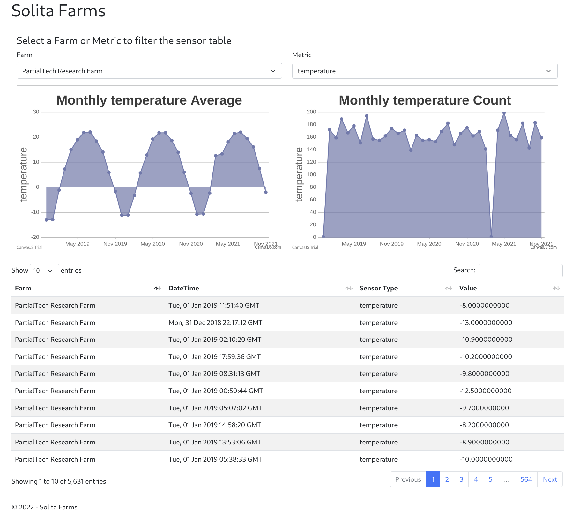

# SolitaFarms
This project was developed to answer the [Solita Dev Academy 2022 pre-assignment](https://github.com/solita/dev-academy-2022-exercise). 

The project uses Python programming language, and Python libraries such as SqlAlchemy, Flask, and Pandas.

## Setting up the project
This project uses a python virtual environment to set up all the dependencies.

To begin the setup of the virtual environment
*  Install python `(version 3.9)`
*  Install anaconda or [miniconda](https://docs.conda.io/en/latest/miniconda.html)

All project dependencies have been exported to a virtual environment configuration file **environment.yml**.

Create and activate the virtual environment with the command below

````bash 
    conda env create -f environment.yml
    conda activate solita 
````
if the virtual environment is set up and activated correctly, the prompt should show
   `(solita)` 

## The database
The database uses **SQLite**; hence no installation is needed. 
The database also uses **SQLAlchemy** library for database access and Object Relational Mapping (ORM).

### Setting up the database
* Ensure that you have set up the virtual environment as described above
* run the following command at the root of the project folder
    ````bash 
        python -m setupdb
    ````

At this point, the database is created at `data/db/solitafarms.db` and populated with all the CSV data at the `data/external` directory.  If the database already exists, it is deleted and recreated.

You can find a SQL dump of the database schema and data at `data/db/solitafarms.db.sql`

## The REST API
The REST API was implemented using **FLASK microframework**(http://flask.pocoo.org/), which is a python framework.  


### Setting up and running the API
To set up and run the API, please follow the following steps.

1. Ensure the project and database is setup as described in the **Setting up the project** and **The database** sections
2. run the command at the root of the project folder
    ````bash
        python -m src.resources
    ````
3. The command in step 2  will start the FLASK built-in web server with the address **http://localhost:5000** , or a similar address. The actual address will be displayed in the command prompt. 
4. You can now send request to the api using a web browser or a rest client 
5. The endpoints of the api are as follow:
    * List all farms: `/solitafarms/farms/`
    * List per month data for a farm: `/solitafarms/farms/<farmId>/month/<monthOfYear>/`. Replace `<farmId>` and `<monthOfYear>` with a farm Id and Month of Year (between 1 and 12)
    * List all metrics: `/solitafarms/metrics/`
    * List per metric data for a farm: `/solitafarms/farms/<farmId>/metric/<metricId>/`. Replace `<farmId>` and `<metricId>` with a farm Id and metric id
    * List montly aggregates of metric data for a farm: `/solitafarms/farms/<farmId>/metric/<metricId>/monthly-aggregates/`.Replace `<farmId>` and `<metricId>` with a farm Id and metric id

## Unit Testing
To test the database, ensure the project and database is set up as described in the **Setting up the project** . The tests will automatically setup the test database and REST API 

To run the tests:

* run the command using the command partern 
    ```bash 
        python -m test.<name_of_test_file_without_.py_extension>

An example  of the commands to run the test cases are:
* Database Test: **python -m test.db_tests** . This will test whether the database tables are created and populated. It also tests the validity of the data; for example, metric types are only temperature,rainFall and pH, pH values are between 0 - 14. 
* REST API Test: **python -m test.rest_api_tests** . This will test whether, for example, farms data is located correctly, in JSON format and the response has Content-Type header,  wrong URL returns 404, invalid URL variables (example month 34) is validated and returns 403.s

The test results are displayed on the command prompt. A sample test report (`testReportDB.text`) is located in the `test` directory 

## The web client

The Web client focuses on the features specified in the [Solita Dev Academy 2022 pre-assignment](https://github.com/solita/dev-academy-2022-exercise) instruction than styling or beautiful designs. 

The web client's dependencies are loaded over the `internet`.  The dependencies are:

* bootstrap(http://getbootstrap.com/)
* jquery (https://jquery.com/)
* datatables (https://datatables.net/)

Running the web client will also run the REST API. Therefore, ensure the project and database is set up as described in the **Setting up the project** and **The database** sections.

To set up and run the web client, please follow the following steps.

1. Ensure the project and database is setup as described in the **Setting up the project** and **The database** sections
2. on the command prompt, run the command 
    ```bash
        python -m src.solitaFarms
3. The command in step 2  will start the FLASK built-in web server with the address **http://localhost:5000**, or a similar address. The actual address will be displayed in the command prompt.
4. You can now open the web client in a browser with the address **http://localhost:5000/web** 
5. A sample screenshot of the web client can be seen in **web_app_screen.png**, or as displayed below



### Web Client testing
You will need to install and use a chrome browser to test the web client. The Web client testing has a dependency of Selenium python library and **ChromeDriver** (https://sites.google.com/chromium.org/driver/).  

**Step 1**

Please download the ChromeDriver, which is compatible with your chrome browser version and your operating system. For example, the development computer had chrome version 95 and Linux 64 operating system, hence `chromedriver_linux64/chromedriver` was downloaded.

**Step 2**

The Web Client (including the REST API) should be running with the built-in Flask server, in a **separate command promt** to successfully test the web client.  Follow the steps in setting up and running the **The web client** as described above.

**Step 3**

Open a **separate or second command prompt** to run the web client test.   

1. The web client test script located at `test/web_client_tests.py` has the following required settings which you should provide in the script

* `CHROME_DRIVER_URL` : The URL to the ChromeDriver, downloaded earlier, for example `chromedriver_linux64/chromedriver`
* `WEB_APP_URL` the URL of the web client, for example, `http://localhost:5000/web/`


2. Activate the solita environment virtual environment with the command 
````bash 
    conda activate solita 
````
if the virtual environment is set up and activated correctly the prompt should show `(solita)`

3. run the tests with the command `python  -m test.web_client_tests`. 

The test results are displayed on the command prompt. A sample test report (`testReportWebClient.text`) is located in the `test` directory 
